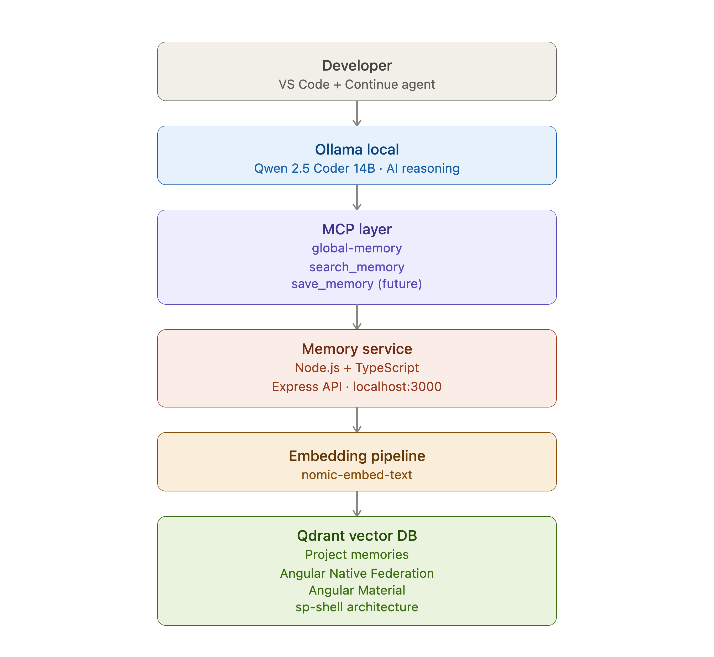

# Local AI Memory Assistant

## Objetivo del proyecto

Este proyecto tiene como objetivo crear un asistente de inteligencia artificial local para desarrollo de software con memoria persistente.

La idea es disponer de una alternativa privada a los asistentes cloud, utilizando modelos locales capaces de entender proyectos, recordar decisiones técnicas y recuperar información relevante cuando sea necesaria.

El sistema combina un modelo LLM local con una arquitectura RAG (Retrieval Augmented Generation), donde la información se almacena como memoria vectorial y se recupera mediante búsquedas semánticas.

## ¿Qué se pretende conseguir?

- Tener un asistente de programación completamente local.
- Permitir que la IA recuerde la arquitectura y decisiones de los proyectos.
- Evitar repetir contexto cada vez que se inicia una conversación.
- Mantener la información privada en el equipo local.
- Crear una base extensible para agentes inteligentes especializados.

## Arquitectura

El sistema utiliza:

- **Continue** como interfaz de agente dentro de VS Code.
- **Ollama** para ejecutar modelos LLM localmente.
- **Qwen 2.5 Coder** como modelo especializado en programación.
- **MCP (Model Context Protocol)** como capa de comunicación entre el agente y las herramientas.
- **Memory Service** como servicio propio de gestión de memoria.
- **Qdrant** como base de datos vectorial.
- **nomic-embed-text** para generar embeddings locales.



## Funcionamiento

Cuando el usuario realiza una consulta sobre un proyecto:

1. El agente analiza la petición.
2. Decide si necesita información almacenada.
3. Ejecuta la herramienta MCP `search_memory`.
4. El Memory Service consulta Qdrant.
5. Se recupera la información relevante.
6. El modelo genera una respuesta utilizando ese contexto.

## Visión futura

El proyecto evolucionará hacia un sistema de memoria avanzada capaz de:

- Guardar nuevas decisiones automáticamente.
- Mantener memoria por proyecto.
- Clasificar información por tecnologías y arquitectura.
- Actualizar conocimientos existentes.
- Crear agentes especializados para diferentes tareas.

El objetivo final es construir un asistente de desarrollo local, privado y personalizado que conozca el ecosistema técnico del usuario y pueda colaborar de forma continua en sus proyectos.

Sistema de memoria local para asistentes de programación usando:

- Continue IDE Agent
- Ollama (LLM local)
- Qwen 2.5 Coder
- MCP (Model Context Protocol)
- Memory Service propio con Node.js + TypeScript
- Qdrant Vector Database
- Embeddings locales con `nomic-embed-text`

El objetivo es disponer de un asistente tipo Copilot local con memoria persistente sobre proyectos, arquitectura, decisiones técnicas y documentación.

---

# Arquitectura

```text
                    Continue IDE
                         |
                         |
                    Agent Mode
                         |
                         |
                MCP global-memory
                         |
              search_memory tool
                         |
                         |
              Memory Service API
              localhost:3000
                         |
                         |
                 Vector Search
                    Qdrant
                         |
                         |
              nomic-embed-text
                         |
                         |
                 Stored Memories
```

---

# Componentes

## 1. Continue

Continue es el cliente AI integrado en Visual Studio Code.

Responsabilidades:

- Ejecutar modelos locales
- Gestionar herramientas MCP
- Ejecutar Agent Mode
- Inyectar contexto recuperado desde memoria

Configuración:

```text
~/.continue/config.yaml
```

---

# 2. Ollama

Servidor local de modelos:

```text
http://localhost:11434
```

## Modelos utilizados

### Programación

```text
qwen2.5-coder:14b
```

Uso:

- Chat
- Análisis de código
- Refactorización
- Edición

---

### Autocomplete

```text
qwen2.5-coder:7b
```

Uso:

- Autocompletado rápido estilo Copilot

---

### Documentación

```text
qwen2.5:14b
```

Uso:

- README
- Manuales
- Documentación técnica

---

# 3. Qdrant

Base de datos vectorial local.

Responsabilidades:

- Guardar embeddings
- Buscar información semánticamente
- Recuperar memorias relevantes


Ejemplo:

Consulta:

```text
Angular Native Federation
```

Resultado:

```text
El proyecto usa Angular Native Federation con microfrontends y Angular Material.

El proyecto Angular usa Native Federation con un shell llamado sp-shell.
```

---

# 4. Memory Service

Servicio propio encargado de conectar:

```text
MCP <-> Qdrant
```

Ubicación:

```text
/Users/user-name/Public/memory-service
```

Tecnologías:

- Node.js
- TypeScript
- Express
- Qdrant Client

Puerto:

```text
3000
```

---

# API

## Buscar memoria

Endpoint:

```http
POST http://localhost:3000/context
```

Body:

```json
{
  "query": "Angular Native Federation"
}
```

Respuesta:

```json
[
  {
    "name": "Global Memory",
    "description": "Qdrant local memory",
    "content": "- El proyecto usa Angular Native Federation..."
  }
]
```

---

# MCP Server

Archivo:

```text
src/mcp/server.ts
```

Servidor MCP:

```text
global-memory
```

Herramienta disponible:

```text
search_memory
```

Continue la identifica como:

```text
global_memory_search_memory
```

---

# Flujo completo

```text
Usuario
  |
  v
Continue Agent
  |
  v
Qwen 2.5 Coder
  |
  v
Decide usar herramienta MCP
  |
  v
global_memory_search_memory
  |
  v
MCP server.ts
  |
  v
POST /context
  |
  v
Memory Service
  |
  v
Qdrant Vector Search
  |
  v
Memoria recuperada
  |
  v
Respuesta final del modelo
```

---

# Configuración Continue

Archivo:

```text
~/.continue/config.yaml
```

Configuración actual:

```yaml
name: Main Config
version: 1.0.0
schema: v1

models:

  - name: Qwen 2.5 Coder 14B
    provider: ollama
    model: qwen2.5-coder:14b
    apiBase: http://localhost:11434
    roles:
      - chat
      - edit
      - apply

  - name: Qwen 2.5 Coder 7B Autocomplete
    provider: ollama
    model: qwen2.5-coder:7b
    apiBase: http://localhost:11434
    roles:
      - autocomplete

  - name: Qwen 2.5 14B Documentation
    provider: ollama
    model: qwen2.5:14b
    apiBase: http://localhost:11434
    roles:
      - chat


mcpServers:

  - name: global-memory
    command: npx
    args:
      - tsx
      - /Users/user-name/Public/memory-service/src/mcp/server.ts
```

---

# Ejecutar Memory Service

Entrar:

```bash
cd /Users/user-name/Public/memory-service
```

Ejecutar:

```bash
npm run dev
```

Resultado esperado:

```text
Memory service running on port 3000
```

---

# Ejecutar MCP manualmente

Prueba:

```bash
cd /Users/user-name/Public/memory-service

npx tsx src/mcp/server.ts
```

Resultado:

```text
MCP server starting
```

---

# Pruebas realizadas

## Qdrant

Comprobación:

```bash
curl http://localhost:6333
```

Respuesta:

```json
{
  "title": "qdrant - vector search engine",
  "version": "1.18.3"
}
```

---

## Memory Service

Prueba:

```bash
curl -X POST http://localhost:3000/context \
-H "Content-Type: application/json" \
-d '{"query":"Angular Native Federation"}'
```

Resultado:

```text
Memoria global:

- El proyecto usa Angular Native Federation con microfrontends y Angular Material
- El proyecto Angular usa Native Federation con un shell llamado sp-shell
```

---

# Problemas solucionados

## Qdrant Point ID

Error:

```text
value angular-federation-001 is not a valid point ID
```

Solución:

Usar:

- UUID
- Integer

Ejemplo:

```text
7e5b00ce-9a75-4743-b1ee-23ac7614c3
```

---

## results.map is not a function

Problema:

La respuesta de Qdrant era:

```json
{
  "result": []
}
```

Solución:

```typescript
const points = results.result ?? [];
```

---

## MCP Schema error

Error:

```text
Schema is missing a method literal
```

Solución:

Actualizar el uso de:

```typescript
server.tool()
```

con el SDK MCP actual.

---

## MCP Connection closed

Causa:

Configuración incorrecta del arranque MCP.

Solución:

Configurar correctamente:

```yaml
command
args
```

en Continue.

---

# Estado actual

## Funcionando

✅ Ollama local  
✅ Qwen 2.5 Coder  
✅ Continue Agent  
✅ MCP Server  
✅ Memory Service  
✅ Qdrant  
✅ Búsqueda semántica  
✅ Recuperación de contexto  
✅ Respuestas usando memoria global  

---

# Próximas mejoras

## 1. Save Memory Tool

Añadir:

```text
global_memory_save_memory
```

Permitir:

```text
Usuario:
Hemos decidido usar Native Federation

       |
       v

Guardar memoria

       |
       v

Qdrant
```

---

## 2. Metadata avanzada

Actualmente:

```json
{
  "text": "Angular Native Federation"
}
```

Mejor:

```json
{
  "text": "Angular Native Federation",
  "project": "sp-shell",
  "type": "architecture",
  "technology": [
    "Angular",
    "Native Federation"
  ],
  "createdAt": "2026-07-22"
}
```

---

## 3. Memoria por proyecto

Separar:

```text
Global Memory

Project Memory

Session Memory
```

---

## 4. Auto-memory

Permitir que el agente:

- Detecte decisiones importantes
- Guarde información automáticamente
- Actualice memorias existentes
- Elimine información obsoleta

---

# Resultado final

Se ha construido una base de asistente local de desarrollo con:

- LLM local
- Memoria persistente
- Vector Database
- MCP Tools
- Integración con VS Code

Una alternativa privada y extensible a asistentes cloud.


# Scripts de arranque Docker

El proyecto dispone de scripts para facilitar el uso del entorno Docker en desarrollo y producción.

Estructura:

```text
scripts/
├── dev.sh        # Arranque entorno desarrollo
├── prod.sh       # Arranque entorno producción
├── stop.sh       # Detener servicios
└── status.sh     # Ver estado del sistema
```

---

# Preparación inicial

Dar permisos de ejecución:

```bash
chmod +x scripts/*.sh
```

---

# Desarrollo

Para trabajar modificando código:

```bash
./scripts/dev.sh
```

Este modo utiliza:

- `Dockerfile.dev`
- `docker-compose.dev.yml`
- `npm run dev`
- Hot reload con `tsx watch`

Flujo:

```text
Código fuente
     |
     ↓
src/*.ts

     |
     ↓

Docker Volume

     |
     ↓

tsx watch

     |
     ↓

Memory Service actualizado
```

Ventajas:

- No es necesario reconstruir la imagen.
- Los cambios se reflejan automáticamente.
- Ideal para desarrollo y debugging.

---

# Producción

Para ejecutar la versión preparada para producción:

```bash
./scripts/prod.sh
```

Equivalente a:

```bash
docker compose up -d --build
```

Este modo utiliza:

- `Dockerfile`
- `docker-compose.yml`
- TypeScript compilado
- Node.js ejecutando `/dist`

Flujo:

```text
src/*.ts

     |
     ↓

npm run build

     |
     ↓

dist/*.js

     |
     ↓

node dist/index.js
```

Ventajas:

- Imagen optimizada.
- Sin TypeScript en ejecución.
- Entorno reproducible.
- Preparado para despliegue.

---

# Detener servicios

Para detener Docker:

```bash
./scripts/stop.sh
```

Equivalente:

```bash
docker compose down
docker compose -f docker-compose.dev.yml down
```

Los datos persistentes de Qdrant se mantienen.

---

# Estado del sistema

Comprobar servicios:

```bash
./scripts/status.sh
```

Comprueba:

- Ollama
- Memory Service
- Qdrant
- Contenedores Docker


Ejemplo:

```text
=======================================
 Local AI Memory Assistant
 Estado del sistema
=======================================

▶ Ollama
✓ Running

▶ Memory Service
✓ Running

▶ Qdrant
✓ Running


Docker:

NAME              STATUS
memory-service    Up
qdrant            Up
```

---

# Servicios disponibles

| Servicio | Puerto | Descripción |
|---|---|---|
| Ollama | 11434 | Modelos LLM locales |
| Memory Service | 3000 | API de memoria MCP |
| Qdrant | 6333 | Base de datos vectorial |

---

# Flujo recomendado

## Desarrollo diario

```bash
./scripts/dev.sh
```

Modificar código:

```text
src/
```

Probar con:

```text
Continue Agent + MCP
```

---

## Preparar versión producción

```bash
./scripts/prod.sh
```

---

## Revisar estado

```bash
./scripts/status.sh
```

---

## Finalizar sesión

```bash
./scripts/stop.sh
```

---

# Resumen de comandos

| Acción | Comando |
|-|-|
| Desarrollo | `./scripts/dev.sh` |
| Producción | `./scripts/prod.sh` |
| Estado | `./scripts/status.sh` |
| Detener | `./scripts/stop.sh` |
| Logs | `docker compose logs -f` |
| Reconstruir | `docker compose up -d --build` |
